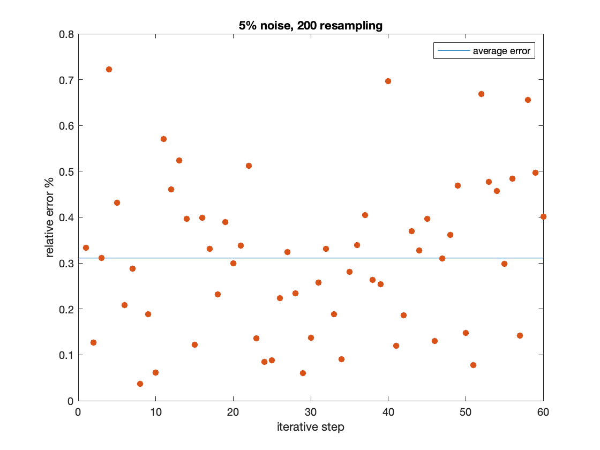

## Robotic

### Questions Part C.

#### choose the controller to guide the robot positions

- Povide the dummy sensor’s data (for the position ) to the controller
  - the sensor’s data must have the positions and rotations
- Induce some error which is handled by the controller
- Incorporate the singularity conditions for movements
- Justify your design of method
- Incorporate filter for optimisation
- Develop a program in Matlab with the robot model which uses the kinematics and control for the robot’s movement

#### Solution

​	 We use the State Variables $\mathbf{q}$ to describe the data provided to sensor
$$
\mathbf{q} = [\theta_0,\theta_1,d_2,\theta_3,\theta_4,\theta_5 ]
$$
where the robots are of ‘RRPRRR’ device. The forward kinematics differential will be:
$$
\text{d}\mathbf{x} = \mathbf{J(q)}\text{d}\mathbf{q}
$$
where $\mathbf{x} = [x,y,z,\alpha,\beta,\gamma]$ is the manipulator’s position and orientation in global coordinate, and $\mathbf{J}$ is robot’s Jacobian matrix of the below manipulator. The Jacobian matrix is related with the device setting and the current state (joint angle and arm offset), with the relationship of 
$$
\mathbf{J(q)} = \frac{\partial \mathbf{x}}{\partial \mathbf{q}} = \text{matrix}\left(\frac{\partial x_i}{\partial q_j}\right)_{ij}
$$


​	

​	The D-H parameters of this robot is shown below and the transform matrix will be:
$$
T^B_E = (T^0_1)(T^1_2)(T^2_3)(T^3_4)(T^4_5)(T^5_6)
$$
where the $T_{i+1}^{i}$ is the homogeneous transform matrix from joint  $i$ to joint $i+1$.

| Joint | $\theta_i$ (offset) |  $d_i$   | $a_i$ | $\alpha_i$ |
| :---: | :-----------------: | :------: | :---: | :--------: |
|   0   |    $\theta_0(0)$    |    1     |   0   |  $\pi/2$   |
|   1   |    $\theta_1(0)$    |    0     |   0   |  $\pi/2$   |
|   2   |          0          | $d_2(0)$ |   0   |     0      |
|   3   |    $\theta_3(0)$    |    0     |   0   |  $-\pi/2$  |
|   4   |    $\theta_4(0)$    |    0     |   0   |  $\pi/2$   |
|   5   |    $\theta_5(0)$    |    1     |   0   |     0      |

​	And with knowledge of D-H description, the transform matrix of each pair of adjacent joints is 
$$
T^{i-1}_{i} = \left(\begin{matrix}
\cos\theta_i&-\sin\theta_i\cdot\cos\alpha_i&\sin\theta_i\cdot\sin\alpha_i&a_i\cdot\cos\theta_i\\
\sin\theta_i&\cos\theta_i\cdot\cos\alpha_i&-\cos\theta_i\cdot\sin\alpha_i&a_i\cdot\cos\theta_i\\
0&\sin\alpha_i&\cos\alpha_i&d_i\\
0&0&0&1\\
\end{matrix}\right).
$$
​	The singularity conditions for movements will be 
$$
\mathbf{J(q)\mathbf{v} = 0}, \mathbf{v} \text{ is an singularity direction.}\\
\Rightarrow \text{ Singularity point}\;\mathbf{q_s}\big|_{\det\left(\mathbf{J(q)}\right) =0}
$$
​	This conditions means that at some joint state, manipulator’s Jacobian materix is of singularity, with zero determinant. 

​	With the description of the kinematic model, we can then describe the task. The task is described as a tranjectory following plan, where the tranjectory of the terminal manipulator is giving as a 3-dimensional space curve with the start point consistenting with initial position of the manipulator.

​	The feedback controlling system of trajectory manipulation are shown below.


​	and the control equation (feedback loop) will be:
$$
dx = x_\text{desired}-x \\
dq = J^{-1}dx\\
q_\text{desired} = dq + q_\text{current}+\eta_\text{err}\\
J(q_{\text{current}^+})\rightarrow J\\
q\rightarrow^\text{fkine} x
$$
​	

​	A dummy sensor will read $q_\text{current}$ from last loop and a dummy actuator will transform the $q$ to $q_\text{desired}$ then generate new $q_\text{current}$.We have to say that this feedback system may iterate serval times to reach desired position  for a specific outer error. The continue condition will be $\frac{1}{2}||x-x_\text{desired}||^2_2\le \varepsilon$, where $|\varepsilon|> \frac{1}{2}||\eta_\text{err}||$.

​	To program the model, we will use MATLAB Robotic Toolbox to develop the robot. The fine algorithm have implement the following control logic of using the itegration method , so we only need to implement the feedback system.

```matlab
% from spatial curve generate the position.
% u [0,1]
function q = calc_from_function(u) 
q(1) =  5 * sin(2*pi*u);
q(2) = -3 *u^2 - 4 * sin( 8 * pi * u);
q(3) = -6*u^3;
end

for i = 1:n
% x
qi = calc_from_function(1/n * i);
B = pose_desired(qi);
F = double(T);
F([1,2,3],4) = 0;
T = SE3.convert(F) + B;

%induce 5% noise 
eta = unifrnd(-pi/40,pi/40,[1 6]);
eta(3) = abs(eta(3));

%feedback <-
% backward kinematics
A(i,:) = robot_mine.ikine(T ,'mask',[1 1 1 0 0 0]);
A(i,3) = abs(A(i,3)); 
scatter3(qi(1),qi(2),qi(3),'filled');
% forward kinematics
T = robot_mine.fkine(A(i,:) + eta);
%feedback ->
end

robot_mine.plot(A,'workspace',[-6,6,-6,6,-10,2]);

% change pose T with dx
function x_d = pose_desired(q)
c = zeros(4,4);
c(1,4) = q(1);
c(2,4) = q(2);
c(3,4) = q(3);
x_d = SE3.convert(c);
end
```

​	The figure show the plot of the goal curve(line) and the trajectory of terminal manipulator (colorful point), an animation will be provided as well. 


​	When we plot the pose of terminal manipulator and goal function, the below figures show the result. 

- 5% induced error to the sensor

  

- 0.5% induced error to the sensor

  

- Zero error of the sensor (ideal)

  

  

  

​    The above result verifies that the design of the trajectory planning algorithm is correct and converge to ideal pose when sensor error remains to zero.	

​	However, when there are error exist, we have to introduce filter for the sensor to make such optimization and reduce error. We introduced average filter to deduced the white gaussian noise. The flow diagram can be shown below.


​	

​	The state function $\sum$ is an average accumulator with:
$$
\sum(X_i)=\sum^n_{i=1}\frac{X_i}{n}
$$
 means resampling and averaging. 

```matlab
function eta = sum_and_mean(n)
eta = zeros(1,6);
for i = 1:n
eta = eta +  unifrnd(-pi/40,pi/40,[1 6]);
end
eta = eta/n;
end

```

​	Introducing 5% (5% compared with joint angle range) white gaussian noise with 10, 50, 200,1000 time resampling, we have the error shown below:

​	

	 

     

​		According to statistical theory,  resampling $N$（which means that we have a new statistic $Y = X_{1i}+X_{2i}+\cdots+X_{10i},\; X_{ji} \;i.i.d$） reduces the standard deviation of gaussian white noise with rate $1/N$. So this filter con optimize the influence of noise, but with cost of delay.

​	

